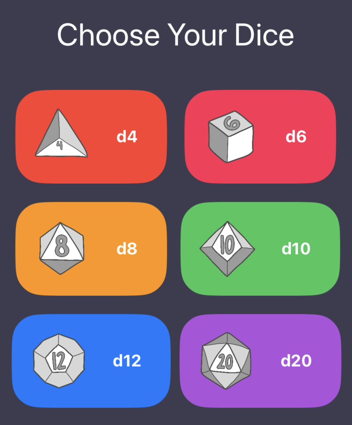
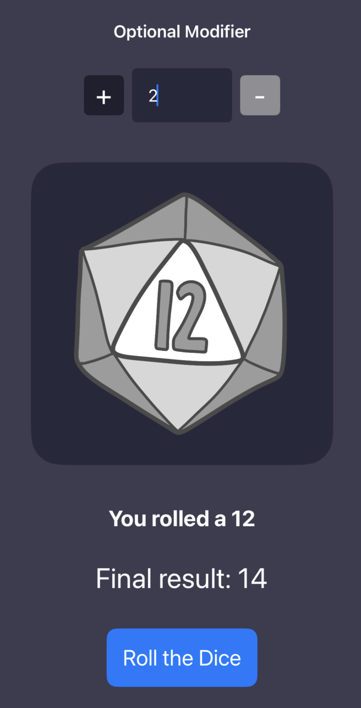

# XDice

An iOS application to roll dice for tabletop games such as Dungeons and Dragons using [Swift]. 
There are 6 different options: d4, d6, d8, d10, d12, and d20.
There is an optional user input section for users to add modifiers depending on their character's skills.
When a user rolls a 1 or a 20 (or the highest number of the die), fun sound effects play.
A sound effect also plays when the dice is rolled.
All dice were hand drawn by me.

[Swift]: https://www.swift.org/
